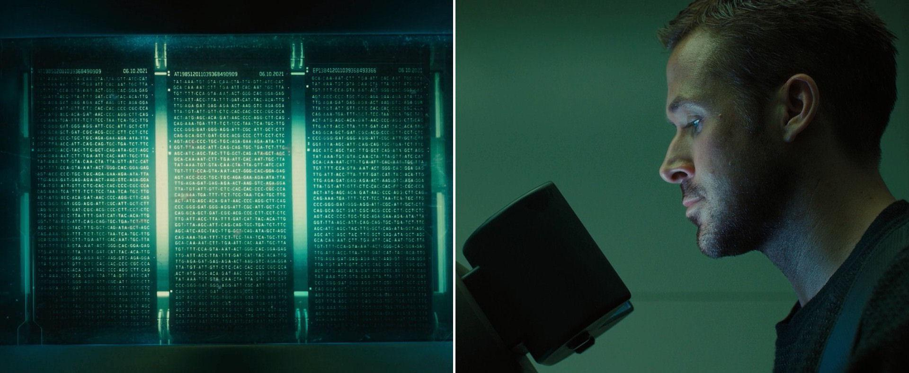
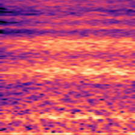
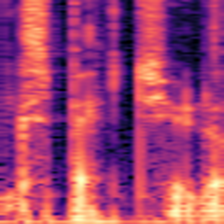
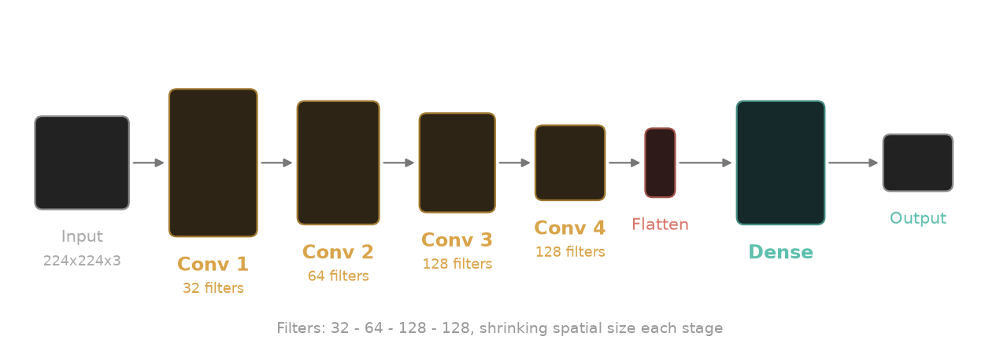

+++
title = "Teaching a computer the shape of my breath"
date = 2026-07-07
description = "I trained a CNN to find breath sounds in audio, because editing them out by hand was the beginning of the frustration."

[extra]
image = "/writeups/breath/k-scanning-dna.jpeg"
+++



I've been recording my own voice now for over 3 years; one issue that comes
from that is microphones are indifferent: everything is recorded. Every inhale
between sentences sits there in the waveform, some even interrupting phrases.

The traditional fixes are both bad. You can edit them out by hand: zoom into
the waveform, find each breath, cut it, patch the hole, which is exactly as
tedious as it sounds. Or you can throw noise tools at the problem, which
bring their own plethora of issues. Cutting off the beginning or ending of
words, catching whispers or sighs, or just ruining the quality of the audio
outright.

I did the manual version for a while. Then I decided this is a menial task that
could potentially be automated. Surely there must exist something I could make
that would allow my computer to do this for me.

I built **Breath**: a pipeline
that finds the breaths with a convolutional neural network, lets me review its 
guesses, and patches over the approved ones with real room tone from the recording
itself.

## The pipeline

The whole thing is six Python scripts working sequentially in unison:

```
Raw WAV + Audacity labels
  → split_audio.py      (0.5s clips, augmented)
  → convert_to_mel.py   (mel-spectrogram images)
  → train_cnn.py        (trained SpectrogramCNN)

Target WAV
  → inference.py        (sliding-window predictions)
  → waveform_viewer.py  (PyQt6 review GUI)
  → edit_audio.py       (room-tone-patched WAV)
```

The top half is training, the bottom half is day-to-day use. Everything speaks
Audacity's label format, which is simply timestamps accompanying the audio file.
So at any point I can pull the intermediate results into Audacity and look at
them.

## Treating audio as an image problem

After much research, I stumbled upon doing something a little unorthodox.
Instead of training a model to learn my specific audio signature, I would turn
it into a game of simple flash cards. Converting the audio into images, and
showing them to the model to train upon and identify speech versus breaths.

A breath in a mel-spectrogram has a recognizable visual shape: a soft,
unstructured wash of broadband energy, nothing like the sharp harmonic columns
of speech. So instead of reaching for 1D sequence models like LSTMs or RNNs
(computationally heavy, harder to parallelize), I convert half-second chunks
of audio into spectrogram images and hand them to a small convolutional
network. CNNs are fast to train, scale efficiently on a GPU, and naturally
learn translation-invariant features, which is exactly what a breath detector
needs: the energy shape of a breath should be recognized wherever it sits in
the frame.

<div style="display: flex; justify-content: center; gap: 2rem; margin-bottom: 1rem;">
  <figure style="margin: 0;">
    
    <figcaption style="text-align: center; font-size: 0.85rem;">Breath</figcaption>
  </figure>
  <figure style="margin: 0;">
    
    <figcaption style="text-align: center; font-size: 0.85rem;">Speaking</figcaption>
  </figure>
</div>

The spectrogram transform (`convert_to_mel.py`) uses:

- `n_fft = 2048`, `hop_length = 512` - a balance between frequency resolution
  (separating bands) and temporal resolution (locating breath boundaries)
- `n_mels = 128` mel bands, because mel spacing matches human pitch
  perception: more resolution in the low-to-mid range where speech and breath
  actually live
- `f_max = 8000 Hz` - speech and breath carry almost all their information
  below 8 kHz, so capping there throws away mic hiss and sensor noise for free
- dynamic range scaling to decibels, then rendered as 224×224 RGB images with
  the `magma` colormap

The colormap choice matters more than it sounds. `magma` is perceptually
uniform, luminance increases monotonically with intensity, so louder always
means brighter, pixel for pixel. The CNN's early filter layers get clean
structural edges to learn from instead of colormap artifacts.

Conversion runs on the GPU (ROCm via PyTorch) with a
`ThreadPoolExecutor` of 16 workers coordinating disk reads, GPU
preprocessing, and image writes, so regenerating the dataset takes seconds
rather than minutes.

## Making a dataset out of two recordings

My entire training set came from two raw recordings that I labeled by hand in
Audacity. `split_audio.py` parses those labels and cuts the audio two ways:

- **Breaths:** each labeled breath is sampled *five* times, as overlapping
  0.5-second windows centered at time shifts of −0.15s, −0.05s, 0.0s, +0.05s,
  and +0.15s. This translation augmentation multiplies the rare class and
  stops the model from overfitting to breaths that happen to sit dead-center
  in the clip.
- **Speech:** the gaps between breath labels are sliced into contiguous
  0.5-second blocks, no augmentation.

Clips land in `Input/Breath/` and `Input/Speaking/`, and each run writes into
a fresh `Dataset_N` directory so I never clobber earlier data.

The final dataset: **5,406 spectrograms** - 4,671 speaking, 735 breath.

Without the 5-shift augmentation the speaking-to-breath ratio would have been
about **31:1**; augmentation brings it down to a workable **~6.3:1**. That
ratio is the central engineering problem of the whole project, because a
naive model trained on it "collapses": it learns to answer "speaking" to
everything, scores a deceptively respectable ~86% accuracy, and is completely
useless.

## Fighting model collapse

`SpectrogramCNN` is quite standard: four convolutional layers (32 → 64 → 128
→ 128 channels), each followed by ReLU and max-pooling, then a 512-unit fully
connected layer, `Dropout(0.5)`, and a two-class head.



The interesting part is the training loop, which is mostly a set of defenses
against the class imbalance and the tiny dataset:

1. **Inverse-frequency class weighting** in the cross-entropy loss, so
   misclassifying the rare class hurts proportionally more. Misidentifying
   speech doesn't create as steep of a negative as misidentifying a breath would.
2. **An extra thumb on the scale:** on top of the inverse-frequency weights,
   the breath penalty is multiplied by 2.0 (`class_weights[breath_idx] *=
   2.0`). I'd rather the model over-report breaths and let me reject false
   alarms during review than silently miss real ones; recall is the metric
   that matters, because I'll check every audio anyways. One missed breath
   would take longer to remove than rejecting a false flag would.
3. **Validation-guided checkpointing:** 80/20 train/validation split, and the
   checkpoint (`best_mel_cnn.pth`) only updates when the *validation* F1 of
   the breath class improves, never on training loss. I purposely keep data
   hidden from the model, so I have a "controlled" set of data to verify the
   model's perceived scores against. This data is never used to train the model,
   only verify scores.
4. **Early stopping:** max 20 epochs, but training stops if validation F1
   hasn't improved for 5 consecutive epochs. With two source recordings, the
   network could easily memorize the mic coloration and room resonance of
   those specific files instead of learning what a breath is; patience-based
   stopping cuts that off. Overfitting is a real issue with a dataset of this
   size, so stopping the model before it begins to focus on the wrong data
   points is crucial to proper training.
5. **Dropout(0.5)** before the classification head, forcing redundant
   representations instead of brittle pixel combinations. By purposely 
   rotating through select neurons, it creates robust pathways spread evenly
   across the layers.
6. **Fine-tuning safety:** if `best_mel_cnn.pth` already exists, training
   resumes at a lower learning rate (0.0001 instead of 0.0005) so early large
   gradients don't bulldoze the features the model already has. This helps to
   establish a "knowledge basis" the model can refine and build on.

Training runs under PyTorch's Automatic Mixed Precision (`torch.amp.autocast`
plus `GradScaler`), most ops in FP16, the numerically sensitive ones in FP32,
which roughly halves memory use and keeps training fast on a consumer GPU.

## Model training accuracy scoring

On the held-out 20% validation set (1,082 images):

- **Overall accuracy: 99.63%** (1,078 / 1,082)
- **Breath F1: 0.9876**
- **Breath precision: 0.9815** - 3 speech segments mistaken for breath
- **Breath recall: 0.9938** - 1 breath missed out of 160

Every clip lands in one cell of the table below: the top-left and
bottom-right cells are correct calls, the other two are the model's mistakes.

|  | Model said breath | Model said speaking |
| :--- | :---: | :---: |
| **Actually breath** | 159 | 1 |
| **Actually speaking** | 3 | 919 |

Across the full 5,406-image dataset it's the same story:

- **Overall accuracy: 99.69%** (5,389 / 5,406)
- **Breath F1: 0.9886**
- **Breath precision: 0.9787**
- **Breath recall: 0.9986** - exactly 1 breath missed out of 735

|  | Model said breath | Model said speaking |
| :--- | :---: | :---: |
| **Actually breath** | 734 | 1 |
| **Actually speaking** | 16 | 4,655 |

Sixteen false positives across the whole dataset is the failure direction I
designed for: false positives aren't worth training against; with a HITL
(human-in-the-loop) review system built, a miss slipping through the cracks isn't terrible.

The honest caveat: this data and training is hyperspecific to controlled
conditions. It knows *my* voice, *my* microphone, *my* room. It is built and
trained around me, so it would absolutely fail if anything was changed in its
environment.

## Inference on real recordings

A trained classifier that eats 0.5-second clips isn't yet a tool that eats a
20-minute recording. `inference.py` bridges that with a sliding window: 0.5s
wide, hopping 0.1s at a time, batched through the CNN. A window counts as
breath only if `prob_breath >= 0.80`, a deliberately high threshold, since
the recall-weighted training already biases the raw probabilities toward
breath.

The raw per-window labels are then cleaned with two heuristics:

- A **"speaking" segment shorter than 0.5s** sandwiched between breaths gets
  flipped to breath; it's almost always a brief dip inside one continuous
  breath.
- A **"breath" segment shorter than 0.2s** gets flipped to speaking; real
  breaths aren't that short, these are clicks and transients.

The output is an Audacity label file plus individual `.wav` snippets of each
detected breath, ready for review.

## Keeping a human in the loop

I never wanted a black box that silently mangles my audio, so the last stop
before anything gets edited is a review GUI (`waveform_viewer.py`), built with
PyQt6 and pyqtgraph. It renders the waveform with each detected breath as a
draggable bounding box. I can nudge the boundaries, play the selection back
with up to 500% volume boost (breaths are quiet, that's the point), and
accept or reject each one. It's the same job as manual editing, except the
finding, the actual tedious part, is already done. Accepted regions append
to `Reviewed/<name>.txt`, and once the last region is judged, the viewer
cleans up and launches the editor automatically. Effectively taking hours of
work and condensing it down to only a couple minutes of clicking "approve" or
"reject".

The final step (`edit_audio.py`) replaces each approved breath not with
silence but with **room tone**: a one-second slice of the recording's own
ambient sound (pulled from a known-clean segment of the track), tiled across
the gap. The pauses end up sounding like the speaker simply didn't breathe,
in the same room, on the same mic. The psychological presence of the space
never drops out. Using the room tone from the recording helps to fight against
what using a predetermined segment would create if room tone or other recording
conditions changed even slightly, amplifying the perceived effect of the
replaced segment.

<hr style="margin-top: 3rem;" />

*Code to be uploaded.*
