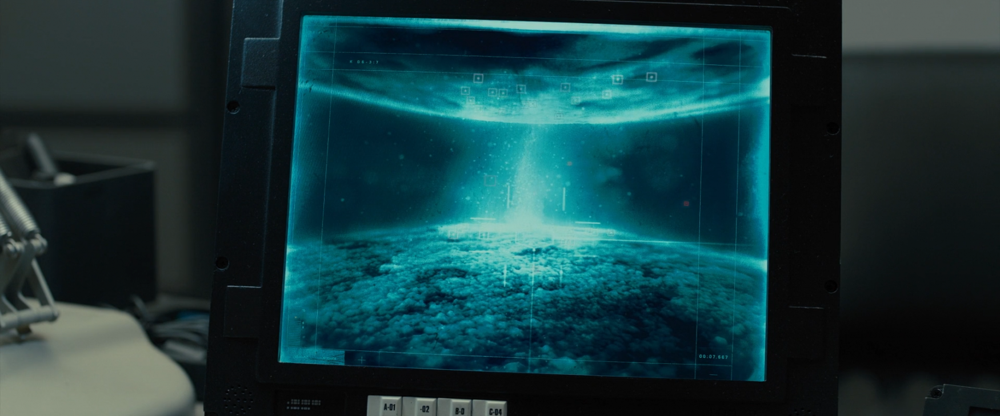
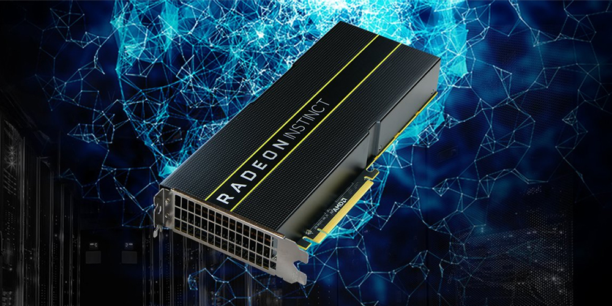

+++
title = "Testing the harbinger of my inference node"
date = 2026-10-03
description = "I bought a decommissioned AMD MI25 to see what a forgotten datacenter GPU can actually do for local inference."

[extra]
image = "/writeups/mi25/joshis-office.png"
+++

When people go looking for cheap VRAM to run local models on, the usual
answers come up fast. The P100 if you're on the green side, the MI50 if
you're on the red one. The MI25 sits one step behind both: same idea, 16GB
of HBM2, passively cooled, pulled out of a server rack somewhere and sold
for a fraction of what it once cost. It's also the one almost nobody talks
about. There are forum posts saying it works with Vulkan, a stray comment
saying ROCm works if you bring the right libraries, and not much else.

The price was the appeal. 16GB of VRAM and a chance to run my favorite model
for a fraction of the cost. I didn't want to read about whether this card was
worth it, I wanted to find out myself: get it running in a normal desktop,
point it at the models I already use, and measure every knob until I knew
where the ceiling actually was and why.

## It wouldn't even boot

The first install didn't make it past early boot. `amdgpu` loaded, tried to
bring the card up, and died: `PSP load sos failed`. The PSP is a small
security processor on the card whose job is to load the firmware for
everything else. It never answered.

<figure style="margin: 0 auto 1rem; max-width: 420px;">
  
  <figcaption style="text-align: center; font-size: 0.85rem;">The Radeon Instinct MI25.</figcaption>
</figure>

Pulling the card's BIOS explained a lot. Mine wasn't a normal MI25 BIOS; it
was a **"VIRTUAL" variant** (`113-D0513500`), built for splitting one card
between virtual machines in a server, capped at 110W. Skipping the PSP
entirely (`amdgpu.fw_load_type=0`) just moved the crash somewhere else in
the driver.

The fix the community converged on is flashing the card with a **Radeon Pro
WX 9100** BIOS, the workstation version of the same chip. That turned out to
be its own small puzzle:

- The current public `amdvbflash` (4.104, on the AUR) refuses. The card's
  BIOS is *newer* than the WX9100 one, and the model ID doesn't match
  (`0C35` vs `0B0F`). AMD removed the option to force past that check from
  the public tool.
- An older Linux build, **4.69** (still hosted by TechPowerUp, checksum
  verified), still has it: `-fs -fp -fv -p 0`.

After a cold boot the card introduced itself as a WX 9100 and the driver
brought up every block cleanly: all 16GB, full PCIe link, Vulkan and ROCm
both seeing it. The flash also set a 170W power cap, a number that ends up
mattering more than anything else in this writeup.

## Getting software to talk to it

Seeing the card and running on it turned out to be two different things.
My installed `llama.cpp` (an AUR build) crashed the moment it tried. GPU
code is compiled ahead of time per chip family, and that package had been
built on this machine *before* the MI25 existed in it: it only carried code
for my 6800 XT (`gfx1030`) and the CPU's integrated graphics (`gfx1036`). The
MI25 is `gfx900`.

So everything from here on runs from separate builds that never touch the
setup the rest of my system uses: a ROCm build targeting `gfx900` only, and
a Vulkan build. Everything below was measured on the model I actually build
around, a 3-bit GSQ-RCO quant of **Qwen 3.8 27B** (a mix of i-quant formats,
mostly IQ3_S).

## Switching from ROCm to Vulkan

| 27B 3-bit GSQ | Reading prompts | Writing |
| :--- | ---: | ---: |
| ROCm (`gfx900` build) | 102 t/s | 10.9 t/s |
| **Vulkan (RADV)** | **114 t/s** | **16.3 t/s** |

Switching from ROCm to Vulkan was worth **+51% on writing**. Nothing I
tried afterwards came close to that again. ROCm still works on this card,
Arch's packages even ship the `gfx900` math libraries, but Vulkan's code for
unpacking compressed weights is simply better suited to this chip. Whether
either library has been optimized has yet to be seen.

## Figuring out where the missing speed is

The obvious assumption with a memory-heavy job like token generation is
that the card waits on memory. It doesn't. The HBM2 can move 484 GB/s; at
16 tokens a second, an 11.8 GB model is being read at under 200 GB/s. Less
than half.

The card sits pinned at its 170W cap the entire time, holding its clock
around 1050–1100 MHz out of a possible 1500. And across every model I
tried, it gets through roughly the same number of weights per second, about
**400–440 billion**, regardless of size or format:

| Model | Writing | Parameters | Weights / second |
| :--- | ---: | ---: | ---: |
| 9B Q4_0 | 45.4 t/s | 8.95B | ~4.1 × 10¹¹ |
| 9B IQ4_XS | 42.1 t/s | 8.95B | ~3.8 × 10¹¹ |
| 27B 3-bit GSQ | 16.3 t/s | 26.9B | ~4.4 × 10¹¹ |

Divide that rate by a 27B and you get 16 t/s, which is exactly what it does.
Parameter count is the biggest lever on this card by a wide margin.

## Tweaking & Tuning

I went through every knob I could find, one at a time, measuring each one
on this card instead of assuming results from cards that look similar on
paper.

| Tweak | Result |
| :--- | :--- |
| i-quant vs classic quant (9B IQ4_XS vs Q4_0) | ~8%. The format isn't the problem. |
| MTP (multi-token prediction) | +5%, even with 70% of guesses accepted |
| Undervolting | Nothing. Table edits barely moved the real voltage. |
| More power (170W → 300W) | Writing 16.3 → 18.5, reading 114 → 126 |
| Forcing max clocks at 300W | 1167 → 1326 MHz average, speed unchanged |
| Latest `llama.cpp` (vs the version I run) | +3–4% |
| AMDVLK (AMD's own Vulkan driver, last Vega release) | −50% writing. RADV wins easily. |
| Rows per workgroup in the mat-vec shader | Default (8) is already best on this card |
| Larger workgroups (only enabled for NVIDIA/Intel) | −24% on AMD |

A few of those deserve more than a row.

**Power.** The WX9100 BIOS caps the card at 170W, and the driver won't go
higher on its own. The card's power table lives in memory, though, and a
small tool called `upp` can edit it. One byte, `PowerControlLimit`, decides
how far above the default the cap is allowed to go. Raising it is software
only, nothing is flashed, and everything resets on reboot. At 300W the
writing speed climbed to about 18.5 t/s. Then I forced the clocks to their
top step and they went up another 14%... and the speed didn't move at all.
That was the moment the bottleneck shifted. Past a point, clock speed
stopped being the thing in the way.

**The shader knobs.** `llama.cpp` already has a GCN-specific setting for
how its matrix-vector code splits up work, and a heuristic for larger
workgroups that's only switched on for NVIDIA and Intel. I added runtime
overrides for both and swept them. The defaults won every time. The MI25 is
the same silicon as a Vega 64, so maybe that's not surprising. But now it's
measured on this card instead of assumed.

**The speed-of-light test.** The last question was whether rewriting the
shader that unpacks i-quants could unlock the rest. Instead of guessing, I
broke it on purpose: a copy that reads exactly the same bytes but skips the
unpacking work, producing garbage output but honest timing. With unpacking
made completely free, that routine got only 21% faster, and the whole token
only 6.5% faster. Even the broken version only pulled about 60% of the
card's bandwidth. The unpacking was a real cost, but a minor one. A rewrite
isn't worth chasing.

## Results so far

| Setup | Writing (27B 3-bit GSQ) |
| :--- | ---: |
| Stock, ROCm | ~10.9 t/s |
| Stock, Vulkan | ~16.4 t/s |
| Latest `llama.cpp`, Vulkan, stock 170W | ~17 t/s |
| Latest `llama.cpp`, Vulkan, 300W | ~19 t/s |

At 19 t/s I pointed my own chat front-end at it and talked to it for a
while. Slow, but usable, and twice where it started that morning.

## The honest caveats

This card is not a fast way to run a 27B dense model. Every knob I could
reach adds up to about 19 tokens a second, and the largest single gain came
from switching the library, not from tuning anything. The theoretical
ceiling (every byte at full bandwidth) is around 41 t/s; nothing I
measured comes close to suggesting this chip can get there for this model.

What the MI25 *is* good at: lots of fast memory for very little money, and
smaller models. A 9B runs at 40–45 t/s.

## Notable mentions

- **Cooling.** Everything here was short runs. My current fan and shroud
  can't keep up with sustained load, so a higher static-pressure fan comes
  before any real use.
- **MoE models.** I only tested dense models. A mixture-of-experts model
  with ~3B active parameters per token should land near the 9B's speed while
  holding far more knowledge. That's probably where this card belongs.
- **The memory access pattern.** The one software lever left: restructuring
  how the mat-vec shader reads memory on GCN. The speed-of-light test says
  the unpacking isn't the problem, which leaves the data movement itself.
  Real GPU-programming work, no guaranteed payoff.
- **A role.** Sitting next to the 6800 XT as a second worker for background
  jobs, or running a smaller model of its own. Either way each `llama.cpp`
  build has to be pinned to its own card, or it'll try to spread a model
  across both and crash on the one it wasn't built for.

*Test builds, overrides, and benchmark scripts to be uploaded to GitHub*
