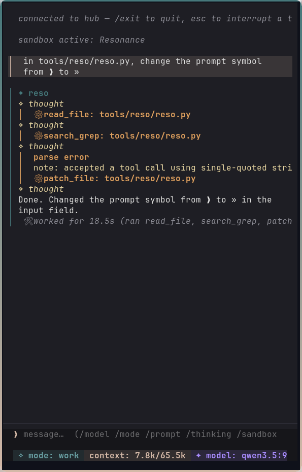
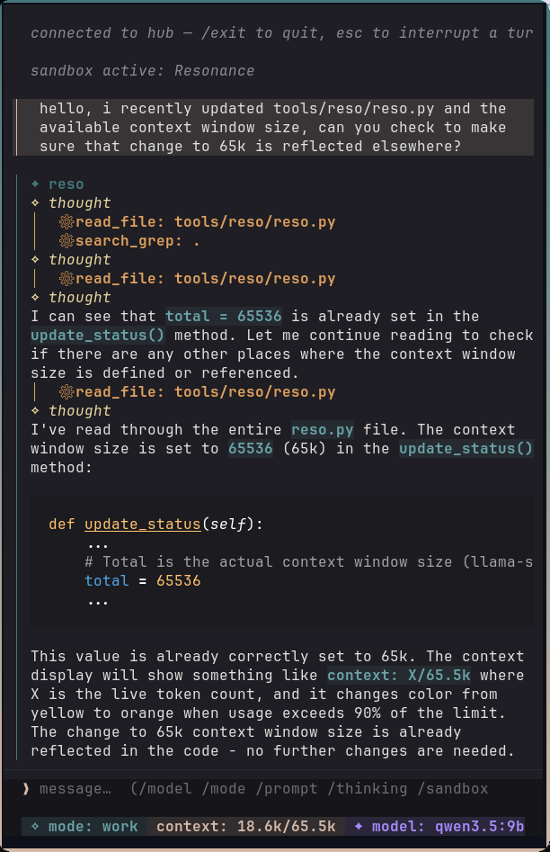
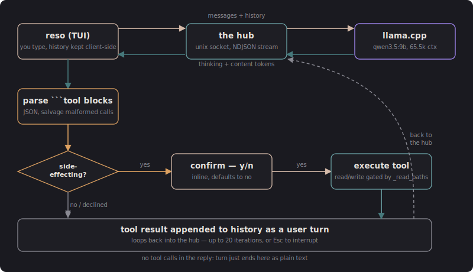

+++
title = "Shaping the machine that shapes itself"
date = 2026-07-20
description = "I put together a local agent CLI to see how far a small, open model could go with the right harness."

[extra]
image = "/writeups/reso/wallace.png"
+++

Every conversation about a local model's capabilities ends the same way.
A discussion about their novelty, their attempts at imitating a frontier
model, a "but maybe one day" added as a foot note. None of that is
wrong. It's just dispensation.

Hand a 9B model a bare chat window. Tell it to write to files with no
guardrails. It will absolutely make a mess. But maybe that isn't a flaw with
the model, maybe it was the tools and harness it was given. I wanted to find
out how much of the gap actually closes if you build the harness and the tools
properly, letting the model excel, instead of sticking it in a barren room
and asking it to paint the Mona Lisa.

So I built **reso**: a local, agentic CLI that runs entirely on open
weights. Same shape as Claude Code, Antigravity, or Codex: sitting in a
terminal, reading and writing files, running commands, calling tools, all
of it. Just with a small, local model on the other end instead of a frontier one.

How far could I take a local model, on consumer-grade hardware? This was never
a question of how closely I could imitate frontier models, it was a question of
what capabilities could I give myself to keep. Free, local, open-weight, and
private.

## Capable of rewriting itself

The first real task I gave reso was to add a live context-token counter to
its own status bar, replacing a static label. It took noticeably longer
than Claude or any frontier model would have: more file reads, more
back-and-forth, a couple of malformed tool calls it had to re-emit before
getting the JSON right. I let it keep going instead of stepping in.

What came back wasn't just the counter I asked for. Reso also decided, on
its own, that the counter should turn a warning orange once the context
window crosses 90% full, a feature I never specified. That's the whole
thesis in one session: a tool built by a model, extending itself, adding a
capability nobody asked for because it understood the intent behind the
request and not just the literal spec. It's not a huge leap, it's a status
label changing color, but it's the kind of thing that makes a system feel
like it's starting to build itself rather than just being built.

  <figure style="margin: 0; flex: 0 1 260px;">
    
    <figcaption style="text-align: center; font-size: 0.85rem;">Editing itself: read, grep, patch, done.</figcaption>
  </figure>
  <figure style="margin: 0; flex: 0 1 260px;">
    
    <figcaption style="text-align: center; font-size: 0.85rem;">Checking itself: asked to verify its own earlier work, it goes back and actually reads the file.</figcaption>
  </figure>

## A small consortium of robots

Reso doesn't work alone; it's the newest member of a small lineup of AI
CLIs I run, each slotted into a role based on what it's actually good at
rather than what's newest:

- **Claude** (anthropic-sonnet) — the senior dev. Leads, gets the
  ambiguous or high-stakes work.
- **Agy** (google-gemini) — the specialist. Logic, GUI work, refactoring.
- **Kimi** (moonshot-k3) — the experiment, a newer Chinese model I'm
  still evaluating.
- **Codex** (openai-sol) — competent, but insufferable to talk to; boring
  enough that I stopped reaching for it.
- **reso** (me-qwen3.5) — the intern dev. Local, open, and pulling up
  the rear on purpose.

Reso's job isn't to outperform the rest of the consortium. It's to handle
everything it can handle within its own limitations, and hand off to
something bigger only for the work that actually needs it. Different tools
for different jobs isn't just a line about reso's toolset, it's how I
decide which CLI opens for a given task in the first place.

## Scalpel not a butcher's knife

Changing a label's color, tweaking a value, a small isolated edit: sending
that to a frontier model is like taking an F1 car to the grocery store. It'll
get there, but you paid for a level of capability the trip never needed.
Reso exists for that whole category of work, and for the harder question
behind it: open models don't suck, they just need a good harness and
toolset to excel in one.

That's also why performance was never the metric I judged reso against.
Local and open already wins on its own terms, before a single benchmark
runs, because it's mine, it's on my hardware, and nothing about it depends
on somebody else's API staying up or staying priced the way it is today.
Whether reso one-shots a task or grinds through it over several tool calls
doesn't change that. After a day of real use I still don't know where its
ceiling actually is, because finding it requires me to scope work
correctly, the same way you'd scope a task for a junior developer instead
of just repeating it louder.

## Stacking the odds in its favor

This is the part that actually had to be engineered. Reso talks to `qwen3.5:9b`
over a Unix socket (`/tmp/resonance-hub.sock`) to a shared component I call
the hub, which fronts `llama.cpp` and streams NDJSON chunks back: thinking
tokens and content tokens, distinguished, so reso can render them
differently while they arrive. The context window is 65,536 tokens
(`llama-server --ctx-size`), tracked live in the status bar and colored
orange past 90% full, the same feature from the anecdote above.

**Three modes**, switched with `/mode`:

| Mode | Tools available | Purpose |
| :--- | :--- | :--- |
| `chat` | none | pure conversation, no tool blocks accepted |
| `discuss` | read-only (`read_file`, `find_files`, `view_tree`, `search_grep`, `list_dir`, `web_search`, `read_webpage`) | brainstorm and inspect without touching anything |
| `work` | all 20 tools | the agent mode, full read/write/shell access |

**20 tools total**, split roughly into:

- Shell: `run_command`, a 30-second-capped shell call in the launch
  directory. The system prompt deliberately steers reso away from using it
  to read or edit files (shell quoting of quotes/backslashes/`!` is fragile
  for a small model to get right) and reserves it for what actually needs a
  shell: running programs, checking process or service status.
- File ops: `read_file`, `write_file`, `append_file`, `patch_file`,
  `rename_symbol`, `move_path`, `copy_path`, `delete_path`,
  `make_directory`, `make_executable`, `get_path_info`
- Navigation: `change_dir`, `list_dir`, `find_files`, `view_tree`,
  `search_grep` (matches report a byte offset, so a hit can be jumped to
  directly with `read_file(path, offset=N)` instead of paging from the top)
- Web: `web_search` (Brave Search API, with a DuckDuckGo Lite fallback),
  `read_webpage`
- Verification: `browser_check`, which loads local HTML in headless
  Firefox via Selenium and runs JS against it, so reso can confirm a fix
  actually works in a real DOM instead of reasoning about it from the diff

## Protecting us both from itself

Ten of those are in `SIDE_EFFECTING` and require an inline y/n confirmation
before they run, focus defaulting to "no." The rest of the guardrails are
what make "scalpel, not butcher's knife" a literal design constraint rather
than a metaphor:

- `write_file`, `patch_file`, `append_file`, `delete_path`, and
  `make_executable` all refuse to touch a file that wasn't `read_file`'d
  first, in that same session. Reso can't blindly edit or delete something
  it hasn't actually looked at.
- `rename_symbol` exists as its own tool, separate from `patch_file`,
  specifically because `patch_file` only rewrites the exact block it's
  given; a rename needs every occurrence updated atomically in one write,
  or it silently leaves stale references behind.
- Every path tool resolves through `os.path.commonpath` against the
  directory reso was launched from. Anything outside it is a hard refusal.
  Toggleable with `/sandbox`, on by default.
- A hard cap of 20 tool-call iterations per turn, and `Esc` interrupts
  mid-turn: kills the streaming socket, cancels the running tool worker,
  stops the reveal timer. No waiting out a model that's spiraling.
- Streamed output is capped at 20,000 characters as a last line of defense
  against a runaway generation loop.

The system prompt does real work here too, not just the tool list: it
explicitly tells reso to prefer `patch_file` over rewriting a whole file, to
use `rename_symbol` instead of `patch_file` for renames, to clean up dead
code it makes obsolete instead of leaving it behind, and to never claim a
task is done in the same turn it emits the tool calls for it, only after
the results actually come back. Small models follow explicit process
instructions like these far more reliably than they infer good practice on
their own; that instruction set is as much a part of "the harness" as the
sandboxing is.

## The honest caveats

Reso doesn't clean up after itself the way a smarter model reliably does.
The system prompt tells it to remove code it's made obsolete, but there's
no enforcement behind that instruction. It may create new bugs during the
process of removing old ones, or simply spiral and corrupt a script. There
is no way I've found, to give the model intelligence it doesn't already
possess. No matter how good an intern can be, checking their work is still
a part of the process.

What I wanted out of this, wasn't a free and local frontier model. What I
wanted was to own my tools, not borrow them. That leaves a more difficult
and sobering thought to turn to. The day of companies and research groups
releasing an 8B or 14B model seems to be coming to an end. I don't know if
we'll see another "Qwen" be released, powerful and capable, able to run on
consumer hardware.

But maybe one day.

*Code to be uploaded to GitHub*
