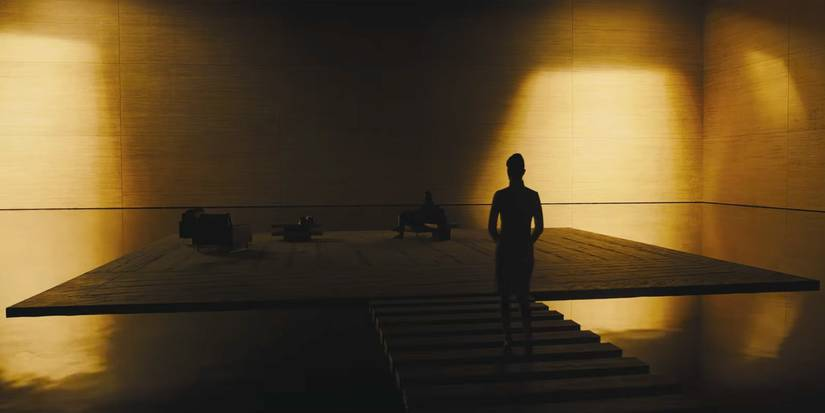
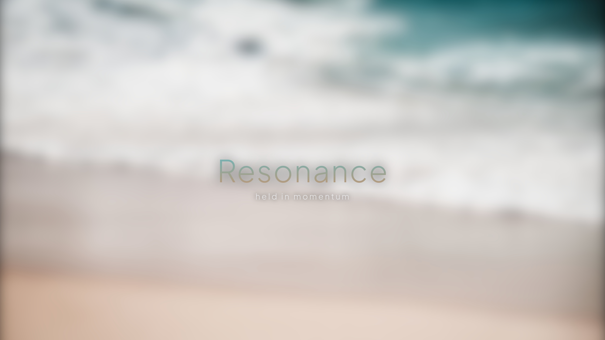
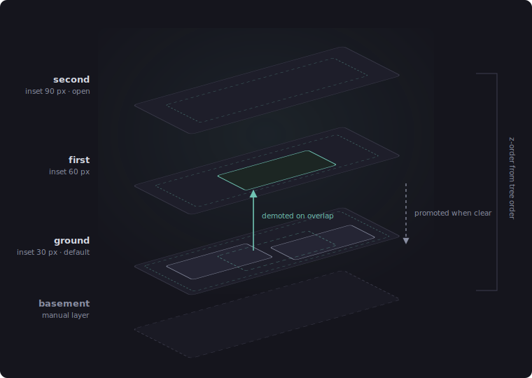

+++
title = "Building a compositor for a userbase of one"
date = 2026-07-14
description = "I rebuilt a 500-line educational Wayland compositor into my daily driver."

[extra]
image = "/writeups/resonance/Wallaces-Office-in-Blade-Runner-2049.jpg"
+++

Every desktop I've ever used manages windows one of two ways, and both are
frustrating.

Floating window managers (Windows, macOS, every mainstream desktop) are
shuffling papers on a desk. New windows land wherever, on top of whatever you
were doing, and organizing them is entirely your job, forever, by hand. The
computer contributes nothing; it's furniture.

Tiling window managers (Hyprland, i3, the whole lineage) fix that by going too
far the other way: open one window and the entire desk rearranges itself.
Everything reshapes, everything resizes, your carefully sized editor is
suddenly half its width because a terminal showed up. The computer
contributes *too much*, and it contributes the same rigid grid no matter what
you're actually doing.

So I built **Resonance**: a *spatial* compositor. Windows don't float in an
unmanaged pile and they don't get flattened into a grid; they live on stacked
**levels**, like floors of a building. A window opens on the ground floor. If
it would land on top of something already living there, it gets *demoted* a
floor up instead of covering it. If space exists on a floor below for it, it
gets *promoted* back down. Each floor sits visually inset from the one below,
so depth reads at a glance, and the compositor remembers which floor and which
spot every app belongs in. A blend between Windows and a tiling manager.

There was no way to bolt this onto an existing desktop, so I built the
compositor itself. I started from **TinyWL**, the ~500-line educational
compositor that ships with wlroots as a teaching example, and did the Ship of
Theseus thing. Boot into it, understand every part, replace planks one at a
time until the boat is something else entirely. Today `tinywl.c` is ~4,700 lines
and the filename is the only original plank left.

One constraint made this interesting: Resonance is my live daily environment.
There is no test rig. Every compositor change gets built and then booted into
as the actual session, which is a strong incentive to make small, reversible
changes and to understand exactly what each one does before committing to it.
Living in the compositor ensures this isn't just a fun weekend project; it's
something whose success I have to guarantee.

## What a compositor actually has to do

A compositor is not quite a "desktop" like Windows; it's more of a director.
It tells the GPU what to draw and the applications where they're allowed to
exist. On Wayland, the compositor is the display server, window manager, and input
handler in one process. Every frame any app draws, every keystroke, and every
cursor movement passes through it. wlroots (TinyWL's dependency) handles the
brutal low-level parts (DRM, GPU buffers, input devices, protocol plumbing)
and hands you building blocks; everything above that is yours to write.

Stock TinyWL supports exactly one shell protocol, two hardcoded keybindings,
and no configuration. Getting from there to something I could actually live
in meant building out, plank by plank, everything a real desktop quietly does
for you:

- **Multi-monitor output layout.** TinyWL auto-arranges outputs; Resonance
  lays out my two displays (2560×1440 and 1920×1080, the smaller one
  vertically centered against the larger) and tracks which one the cursor is
  on, publishing it so
  overlays can open on the monitor I'm looking at.
- **XWayland.** Proxied X11 windows. Without this, Steam and half of
  everything else simply doesn't run. Every window-management feature in
  Resonance had to be implemented twice, once for native xdg-shell toplevels
  and once for XWayland surfaces, because the two APIs share almost nothing.
- **Layer-shell.** The protocol that lets overlays, notifications, and panels
  dock above or below normal windows. Resonance's own overlay tools ride on
  this.
- **Server-side decorations.** Wayland apps expect the compositor to say
  whether it draws window borders. Resonance does, by hand (more below).
- **Screen capture.** A bespoke wlroots screencopy manager, so frames can
  be pulled out of the live scene for screen sharing and screenshots, plus a
  foreign-toplevel manager so capture tools can enumerate windows.
- **Pointer constraints and relative pointer motion.** Without these two
  protocols, first-person games spin wildly the moment you touch the mouse.
- **Drag-and-drop.** Rendering the drag icon that follows the cursor between
  windows; another thing you never notice a desktop doing until it's your job.
- **The IPC port.** The plank everything else in Resonance stands on,
  described next.

## The IPC port: the compositor executes, the brain decides

The most important architectural decision in Resonance is that the compositor
contains no policy. It knows *how* to place a window; it never decides
*where*. All decisions live in a Python process (`core/brain.py` and
`core/placement.py`), and the two sides talk over a Unix socket at
`/tmp/resonance.sock` using a newline-delimited text protocol.

Compositor to brain:

| Message | Meaning |
| :--- | :--- |
| `window-map:` | a window appeared (app_id, title, geometry, numeric id, fullscreen flag, tab-separated) |
| `window-geometry:` | a window moved or resized |
| `window-unmap:` | a window closed |
| `release:` | an interactive drag/resize just ended (mouse-up) |
| `keybind:` / `gesture:` | a bound key or gesture fired |
| `cursor-pos:` | global cursor position, throttled so raw motion events don't flood the socket |
| `env:` | environment handoff (the compositor tells the brain its `WAYLAND_DISPLAY` and XWayland `DISPLAY`) |

Brain to compositor, the entire command vocabulary:

| Message | Meaning |
| :--- | :--- |
| `place:<id> <x> <y> <w> <h> <floor>` | put this window here, on this floor |
| `fullscreen:<id> <0\|1>` | set fullscreen state |

That's it. Two commands. Even keybindings follow the split: bindings live in
`resonance.toml`, the brain flattens them to a file the compositor parses at
startup, and when a bound combination is pressed the compositor doesn't run
anything; it sends `keybind:Super+Space` down the socket and the brain spawns
the process. The C code never grows opinions, which means the part that's
dangerous to change (the thing my session runs inside) stays dumb and stable,
while the part that gets smarter over time is a Python file I can edit and
restart mid-session without dropping a single window.

The brain is a `selectors`-based socket server that also rebroadcasts every
message to all other connected clients, so any future tool can subscribe to
window events or cursor position without the compositor knowing it exists.

## The level system

The heart of the spatial model. Windows live on one of four stacked floors:
**basement, ground, first, second**. In the compositor, each floor is its own
`wlr_scene_tree`, so z-order between floors falls out of tree order for free
and moving a window between floors is a single reparent. The compositor holds
the trees and reparents on command; which floor a window belongs on is
decided entirely by the brain.

The cascade rule: ground floor by default, and ground is the most important
floor; moving away from it is a demotion. When a window
maps, the brain checks whether it overlaps any other primary window already
living on ground; if so it tries the first floor, then the second, landing
on whatever floor has space for it. Nothing that was already open moves an
inch. Drag a window onto an occupied spot and it gets demoted a tier on
release; drag it clear of everything and it earns promotion back toward
ground. The
basement is outside the cascade entirely; it's the manual layer, for things
deliberately put beneath the workspace.

Nothing done on a floor affects the floor below or above it. Clicking within
a window on the ground floor does not cause the window above it to switch floors
with it. One of the most frustrating aspects of Windows is that clicking something
brings it fully to the front: functionality I've never actually needed.

Each floor is also inset from the monitor edges (30 px on ground, 60 on
first, 90 on second; the basement gets none), so higher floors visibly sit
further "in" than the ones below and depth reads at a glance. A window
dragged past its floor's padding gets clamped back in on mouse
release, and the clamp only ever shrinks the offending edges back to the
boundary; it never moves or grows a window that fits.

## Placement memory

A spatial desktop is pointless if it forgets the space. The brain remembers
where windows belong: the persistent store
(`~/.local/share/resonance/placement.json`) is a three-axis lookup of app_id,
then floor, then a list of slots, one per simultaneously-open window of that
app on that floor. Open two terminals on the ground floor in the same order
every day and each one keeps landing back in its own spot. Slot claims are
in-memory per session; the remembered geometries persist.

Geometry is only recorded once a window *settles*: either immediately on
mouse release after a drag, or after 3 seconds without geometry changes for
app-initiated moves. Comparisons use an 8-pixel tolerance everywhere, so a
barely-off drag doesn't trigger a pointless one-pixel correction snap. Every
remembered slot is tagged with the monitor it was recorded on, and memory
recorded on one output is never replayed onto a window that mapped on a
different one; a window straddling a monitor boundary isn't trusted or
recorded at all.

The messy edges took the most code:

- **Splash screens.** Discord, Steam, Audacity, OrcaSlicer, and Kdenlive all
  throw up a loading window before their real one, and the splash isn't
  reliably identifiable by title (OrcaSlicer's splash and main window both
  report "unknown"). So for those app_ids the first window-map since the app
  was last fully closed is treated as unconfirmed and suppressed from
  placement entirely; the second distinct map is trusted as the real window.
- **Generic identities.** Some unparented GTK dialogs report the placeholder
  app_id "GTK Application" instead of their owner's. Those get gated to one
  tracked window at a time so a stray dialog can't hijack its host app's
  remembered position.
- **Fullscreen.** If a window was remembered fullscreen, exact geometry stops
  mattering and only the output does; and because the compositor drops
  fullscreen as a side effect of a `place:` command, any cross-monitor move
  has to be followed by a `fullscreen:` to restore it.

## Push-resize

Windows on the same floor are solid to each other. Grab a window's edge and
resize toward a neighbor and you don't overlap it; you *push* it. The
neighbor slides ahead of the dragged edge, holding a 7-pixel gap, and when it
runs out of room against its floor's padded boundary it starts shrinking
instead, down to a 100-pixel minimum.

The mechanics:

- At grab time, the compositor scans same-floor windows and picks at most one
  neighbor per axis: whichever is nearest the dragged edge in the drag
  direction. Push deliberately doesn't chain past that one neighbor.
- Whether the neighbor actually moves is re-evaluated live on every step of
  the drag; nothing happens until the dragged edge comes within the gap
  distance, however far into the drag that is.
- Once pushed, a neighbor stays pushed; retreating the drag doesn't pull it
  back. This falls out of the state design: the "start" box is updated in
  place after every push step, so the next step measures from wherever the
  neighbor currently is, not where it was at grab time.
- Push reads the dragged window's *actual committed* frame box each step, the
  same way the border rendering does, rather than predicting from the mouse
  position. It reacts when the client really resizes, so it never chases an
  intended-but-not-yet-rendered edge.

After release, the brain settles both windows into placement memory like any
other drag, so a layout you pushed into shape is a layout that comes back.

## Drawing the chrome myself

wlroots gives you no decorations, so borders are rendered by hand: for each
window the compositor allocates a shared-memory buffer (`memfd_create`) and
writes the pixels directly in C, no drawing library involved; a 4px
rounded-corner ring, gradient from teal to warm sand, with a translucent dark
glass fill behind dialogs, attached to the scene under the window. Corner
radius is per-app (12px default; zero for things that should sit flush). Unparented
dialogs get the same glass treatment so they read as part of the environment
rather than floating gray rectangles.

The boot sequence gets the same care, because the first thing the environment
does should not be flashing a terminal at you. `bootintro.c` renders the
wallpaper blurred (three box-blur passes, materially a Gaussian), then fades
in the word mark in Plus Jakarta Sans Light at 96pt, letterspaced, filled
with a vertical teal-to-warm-sand gradient over a blurred drop shadow, with a
subtitle beneath. The phases are hardcoded and unhurried: 2.5 s of sync wait,
2.5 s fade in, 2 s hold, 2 s fade out, and then the desktop is just there.
Not a loading screen; a hello. Auto-start programs are intentionally left
out. I choose what I want to use my computer for, rather than being greeted
at boot by whatever the computer decided to start for me.

Input grew a small gesture recognizer too: holding Super and flicking the
cursor upward (velocity-tracked with accumulated deltas, fired once per
flick) sends `gesture:swipe-up` to the brain, which maps it through
`resonance.toml` like any keybinding. Left will go back on Firefox, right
will be forward, and swiping down will bring the page back to the top.

## Living in it

The real test of a compositor isn't a demo; it's whether you forget it's
there. At time of writing I've been daily-driving Resonance for almost two
weeks: work, browsing, editing, and, the part I genuinely expected to hurt,
games. Having the level system, plus Super+ providing control over windows
at the speed of thought, completely changes how I use a computer. No more
hunting for window edges or title bars; I can do what I need without
friction.

Games mattered more than anything else here, because games are roughly half
of what I do on a computer. If gaming suffered, the project failed, no matter
how clever the level system was. It didn't. Games run flawlessly: fullscreen,
pointer capture, XWayland titles through Steam, all of it. Input latency sits
around 10 ms, framerates are exactly what the hardware should produce, and the pointer-constraints and relative-pointer planks earn their keep every time a
first-person camera doesn't spin into the ceiling. There is something quietly
absurd about it: a bespoke compositor, rewritten plank by plank around one
person, delivering perfectly transparent gameplay as if it were any mature
desktop. It's the strongest evidence I have that the boat actually floats.

In those two weeks it has crashed exactly once, and the culprit was Godot's
window associate/disassociate dance, which managed to hit a path no other
app touches. One crash, one known cause. For a C program I rewrote around
myself while living inside it, I'll take that.

## The honest caveats

Plenty of this system is hardcoded: the output layout, the floor insets, the
boot image path, and more besides. That's not sloppiness so much as scope;
Resonance is built for exactly one machine and one user, and generalizing
numbers that only ever need to be right once would be effort spent on a user
who doesn't exist. The known potential bugs are documented in a standing
review file (blocking IPC writes, a few protocol corners cut), and in almost
two weeks of daily driving none of them has actually become an issue. I keep
the list for when these errors rear their ugly heads.

The bigger truth is that everything described here is the *framework*, not
the destination. What comes next is the system Resonance is actually named
for: input velocity reading my current state, gravity weights learning which
apps belong together, context deciding what surfaces when. All of it will drive placement through the same two IPC commands the current brain uses; the spatial compositor was built as the stage, and the learning system is what walks onto
it next.

Of everything I've built, this is the one I'm proudest of. I know because I'm
typing this inside it.

*Code to be uploaded to GitHub*
