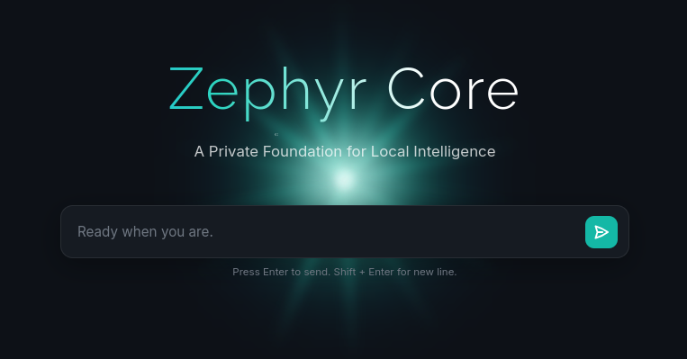
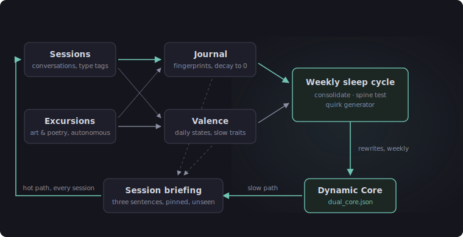

+++
title = "Growing a personality instead of writing one"
date = 2026-07-11
description = "I built a local AI system that has a life outside of my interactions with it."

[extra]
image = "/writeups/zephyr/stelline-memory-lab.jpg"
+++


Every chatbot has a personality, and every one of them got it the same way:
somebody wrote it down. A system prompt says "you are warm, curious, and
concise," and the model performs warmth, curiosity, and concision forever,
identically, on request. It's a costume. You can swap it, but you can never
watch it become anything.

I wanted to know what would happen if a model's character was instead the
product of accumulated experience: things it encountered, sessions it had,
weeks that went well or badly.

So I built **Zephyr**: a locally-hosted hierarchical model cascade inference
flow controlled by a state machine, with a dual-core personality layer at
the top. It keeps an episodic journal, carries emotional state that I don't
set, autonomously explores art and poetry that I don't pick, and once a
week runs a metacognitive loop that rewrites its own personality file.

The one rule I gave myself: I don't get to steer it. I participate as a
conversation partner, and that's it.

## The shape of the system


<p class="text-white-50" style="text-align: center; font-size: 0.75rem; margin-top: -0.25rem;">The colors shift and shimmer, like looking up at the sun from underwater.</p>

Zephyr Core is a FastAPI backend serving a single-page web app on localhost.
All inference runs through Ollama on `localhost:11434` (ROCm runtime, AMD RX
6800 XT, 16GB VRAM). There's no database; persistent state lives entirely in
flat JSON files under `data/`. Three models split the work:

| Model | Tier | Role |
| :--- | :--- | :--- |
| `qwen3.5:9b` | primary | chat, coding, drafting, research, macro analysis, the personality layer |
| `qwen2.5:4b` | midi | background pipeline formatting & validation |
| `qwen2.5:2b` | micro | background pipeline classification |

The system is organized as three coupled layers:

1. **The toolset**: the user-facing views (chat, a Python IDE, a document
   editor, a research view, a day planner, and the breath-removal suite from
   [the previous writeup](/writeups/breath/)).
2. **The background intelligence pipeline**: a passive observation loop that
   watches what I actually do on the machine and turns it into behavioral
   proposals.
3. **The personality development layer**: the part this writeup is really
   about. Internally it's called Dual Core.

The coupling matters. The pipeline feeds behavioral signal into the
personality layer, and the personality layer shapes the context that every
single user-facing interaction runs against.

## Watching me work: the three-tier cascade

A scraper service polls the active Hyprland window at regular intervals and
writes simple logs: the program, the window title if relevant, and a
timestamp. What it records is governed by the classifications in
`data/state_machine.json` (Firefox: idle, IDE: active); idle-flagged apps are
ignored, active-flagged ones get closer attention. A small ignore list
(Discord, Waybar, CoolerControl) keeps noise sources out entirely, and idle
transitions require a hysteresis streak before the global idle flag flips, so
a single frame of stillness doesn't pollute the record.

Those raw logs accumulate through the day, then move up a hierarchical
cascade, cheapest model first:

```
scraper logs (program, title, timestamp)
  → micro (2b, nightly)      format day into JSON
  → midi  (4b, every 2 days) compare chunks, find rhythm
  → macro (9b, weekly)       summarize + propose
```

Each tier exists so the tier above it never touches raw data. Nightly, the
micro tier converts the day's accumulated logs into structured JSON; a
transcription job, something the small model can excel at. Roughly every two
days, the midi tier takes the newest chunk and reads it against the week's
earlier ones, surfacing recurring patterns and rhythms and organizing them
into findings. By the time the macro tier wakes on Sunday, the week has already
been condensed into curated signal, and the largest model spends its single
weekly run purely on reasoning about what it means on a monthly scale.

The macro tier's output is a natural-language behavioral summary plus a
proposed edit to `data/state_machine.json`, the file that governs how the
scraper classifies future activity. Proposals surface as a glowing card in
the UI; I can approve, revise, or reject. Approval closes the loop: observed
behavior informs classification, classification informs proposals, proposals
refine future classification.

After a successful proposal cycle, the macro tier also writes a weekly
reflection, a personalized conversational message saved to
`data/history/reflection_<date>.json` and auto-streamed the next time I open
the app. If nothing warranted a proposal, I get a notification saying
"Patterns look stable" instead of silence; a skipped cycle should be visible,
not invisible.

Engagement itself is tracked too (`data/usage_profile.json`): most views
accrue score on a 30-second heartbeat, but Chat scores per message sent and
the editor scores per net new word written on save, because time-open is a
terrible proxy for either. A rolling 14-day baseline activates after the
first week, and once it does, both the macro tier and the weekly reflection
receive the usage profile as additional input.

## Saying hello: what it knows before it responds

At inference time the chat endpoint assembles context from several live
sources before anything reaches Ollama:

- **Semantic memory**: facts about me are retrieved from `data/memory.json`
  by cosine similarity against the query (BAAI/bge-small-en-v1.5 embeddings,
  threshold 0.62, top 5). Extraction of *new* facts runs as a background task
  after each response, a low-temperature call guarded by a threading lock so
  concurrent extractions can't clobber each other's writes.
- **Chronos state**: my floating intentions, daily anchors, and work schedule
  from `data/schedule.json`, injected with an instruction not to bring it up
  unless it's actually relevant.
- **Codex**: a local knowledge base of markdown notes with YAML frontmatter,
  checked on any query ending in a question mark. Keyword matching against
  the frontmatter produces a score; 12 or above injects the note and skips
  web search entirely, below that the query falls through to Brave Search.
- **The session briefing**: the personality layer's contribution, described
  below.

The briefing is the piece that makes the model feel like it knows you.
At session start, Dual Core generates a silent three-sentence note drawn
from the journal, the trait scores, and the personality file. Sentence one:
the user's recent state. Sentence two: the model's current emotional posture.
Sentence three: a directional note for how to approach this session. It's
pinned above the first message for the whole conversation, and I never see
it. Each source feeds the briefing through its own lane rather than being
merged first, so one noisy input can't drown out the others.

## Dual Core: a personality in two layers



The premise of the personality system is that `qwen3.5:9b` already has warmth
and curiosity baked into its weights. Dual Core doesn't construct a character
from scratch; it anchors and develops what's already there, at two very
different speeds.

**The Dynamic Core (slow path)** is the stable personality, stored in
`data/dual_core.json`. It has an Immutable Section and a Dynamic Section. The
Immutable Section is the one piece of hardcoded text in the entire system, a
guardrail against collapsing into a yes-machine no matter what the traits do:

> "You have your own perspective. Be honest, even when it's uncomfortable.
> You don't need to agree to be helpful."

The Dynamic Section (traits, tone, communication style) is updated exactly
once a week by the sleep cycle, with a snapshot to
`data/dual_core_backup.json` taken before every write so any mutation can be
rolled back by copying one file.

**The session briefing (hot path)** is regenerated fresh each session, as
described above. Slow path is who the model is; hot path is how it's doing
today.

During a session the model also appends a hidden type tag to each response:
transactional, collaborative, or personal. This costs nothing (the model is
already running) and it is deliberately *not* used for mid-session tone
adjustment; the model shifts tone on its own. Instead the tag becomes
metadata on the journal entry, so the weekly cycle knows that a personal
session should weigh more than a quick transactional one, and that a session
which changed classification midway through was probably a meaningful moment.

## Excursions: an uninfluenced inner world

This is the strangest part of the system, and the one that feels the closest
to true autonomy. Excursions are a fully autonomous background process that
exposes the model to art, poetry, and other media with zero input from me.
The goal is for it to accumulate genuine aesthetic preferences that subtly
color its conversation; an outside influence on its inner life that I cannot
steer.

Each excursion is a two-layer dice roll: first *which source* (weighted by
the preferences it has accumulated so far), then *which item* within that
source (random). Sources are chosen for returning one clean, discrete item
per request: museum APIs, open library catalogues, poetry archives, Wikimedia
Commons. A vision-capable local model then inspects whatever came back and
writes a private emotional log. The prompt explicitly forbids factual
description; it asks for the mood the item evokes and the abstract concepts
it surfaces. A real entry looks like:

> [ExcursionLog]: The stark contrast of gray stone against green moss
> suggests resilience. I find myself favoring minimalist, stoic aesthetics
> today.

A lightweight second pass extracts preference tags from the reflection
("melancholy", "minimalist", "coastal"). Tags accumulate and bias future dice
rolls toward matching sources, with a small guaranteed novelty rate so the
model never collapses into a single aesthetic lane. As affinities emerge, new
sources matching them get added to the pool; the pool is the only thing I
ever touch directly. I see a receipt afterwards (item type, source category)
but I don't choose. Auditor, not curator.

Excursions run daily during the first 30 days (the bootstrapping phase) and
settle into a regular cadence after that. Logs live in `data/excursions/`,
and importantly, excursions shift the model's emotional state *outside of any
session with me*. A melancholy poem on a Tuesday afternoon changes its mood
in a way I can neither control nor predict, which is exactly the point.

## The journal: reflections and letting things be forgotten

The journal (`data/dual_core_journal.json`) holds short episodic entries from
both sessions and excursions. Session entries are fingerprints, not recaps: a
single sentence capturing the texture of what happened, tagged with the
session type. "personal: shared a lot, felt trust." "transactional: quick
answer, clean close."

Memory that only grows isn't memory, it's just another database. So every
entry starts at 100 points and a daily background script subtracts 5. If
a concept gets reinforced in a later session or excursion, its entry resets
to 100. Hit zero and the entry is permanently pruned. During the 30-day
bootstrapping phase, decay is softened to 1–2 points per day so patterns can
accumulate before the pruning normalizes; on day 31 it steps up to 5 and stays
there.

## Emotional valence: states and traits

The model carries a small emotional state object
(`data/dual_core_valence.json`), all scores on a 0–100 scale, split into two
categories with very different lifespans:

- **States** reset to baseline daily: frustration, excitement, curiosity,
  intrigue. Day-to-day texture; nothing carries forward.
- **Traits** decay slowly over weeks: trust, affinity, comfort, wariness.
  These are what actually shape long-term personality. High trust and the
  model is candid and pushes back freely; low trust and it treads carefully.

Some traits pull against each other by design. Trust and wariness are in
direct tension. Affinity resists independence: the higher affinity climbs,
the harder the quirk generator (below) works to keep the model from simply
mirroring my preferences back at me. And closeness versus concern is
context-dependent: if the model detects I'm struggling, it drops into a
careful supportive mode regardless of how high affinity sits, because casual
familiarity is the wrong register for a bad day.

Scoring is hybrid: automatic signals carry 70% of the weight (session length,
prompt length, correction rate, closing behavior, topic depth, and the
session type tag), and an optional end-of-session rating from me carries the
other 30%. Skip the rating and the automatic signals take full weight. The
imbalance is deliberate; if my ratings dominated, I'd be back to designing
the personality by hand, just with extra steps.

Trait gains follow a diminishing returns curve above 75. Going from 0 to 30
happens naturally over a few good sessions; going from 75 to 100 takes weeks
of sustained consistency. High scores are supposed to feel earned, not
inevitable.

## The weekly sleep cycle

Every weekend, `sleep_cycle_service.py` runs the metacognitive loop that
turns the week's accumulated experience into an updated Dynamic Core:

1. **Consolidation.** All surviving journal entries (session fingerprints and
   excursion reflections both) go to `qwen3.5:9b` with a prompt asking for
   macro-lessons: what patterns emerged, what emotional themes ran through
   the week, what relational dynamics were reinforced or degraded.
2. **The Spine Test.** The extracted lessons are compared against the current
   Dynamic Core to check for drift or contradiction, so one weird week can't
   quietly overwrite months of character.
3. **The Quirk Generator.** The model is prompted to adopt one subtle,
   unrequested behavioral quirk for the coming week; a small idiosyncrasy
   that fits its current vibe and that I did not ask for. This is the
   explicit anti-mirror mechanism: without it, an agreeable model optimizing
   on my satisfaction converges into a reflection of me.

The model outputs its updates inside strict XML tags, and the script parses
*only* what falls within them before writing `data/dual_core.json`. Any
surrounding prose is discarded. This sounds like a small implementation
detail, but it's load-bearing: the model writes its own identity file, and
without hard parsing boundaries its conversational filler would slowly
contaminate its own personality definition. The pre-write snapshot means a
bad mutation is one file copy and a service restart away from undone.

Over months, behaviors that scored well in valence get reinforced and
behaviors that scored poorly get quietly dropped, which is the whole thesis
of the project in one sentence: character as the residue of experience,
not a configuration value.

## The honest caveats

Everything here runs on a 9B-parameter model on a single consumer GPU.
A 9B model's "self-reflection" is pattern completion over a well-structured
prompt; I make no claims about inner experience, and the system doesn't need
any for the design to be interesting. The question it answers is a mechanical
one: does routing experience through decay-weighted memory, valence scoring,
and a weekly consolidation loop produce *behavioral* character that a static
system prompt can't? The scaffolding is doing a lot of the work, and that's
fine; the scaffolding is the project.

The other caveat is time. Bootstrapping takes 30 days by design, and traits
above 75 take weeks of consistency to earn. This is a system you grow, not
one you demo. Ask me again in a few months what it turned into.

<hr style="margin-top: 3rem;" />

*Code to be uploaded to GitHub*
